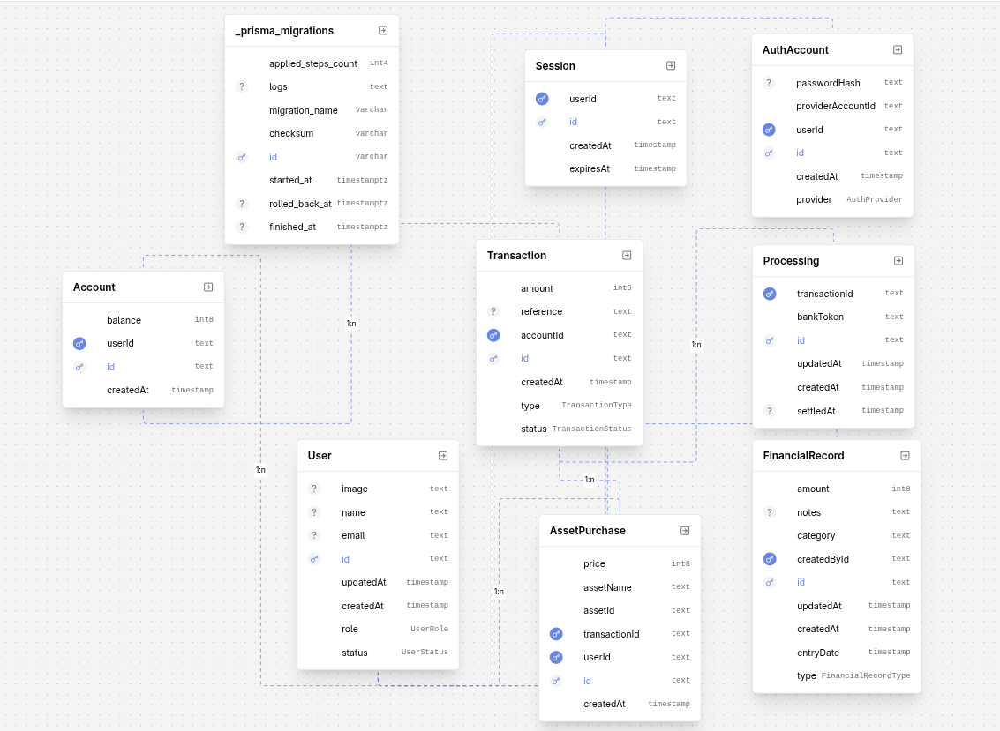

# Zorvyn Finance Data Processing and Access Control Backend

[](https://nodejs.org/)
[](https://expressjs.com/)
[](https://www.prisma.io/)
[](https://www.postgresql.org/)
[](https://www.typescriptlang.org/)

This branch adapts the existing repo into a backend assignment for a finance dashboard system with role-based access control.

The backend now focuses on:

- user management with roles and active or inactive status
- role-based permissions for viewers, analysts, and admins
- financial record CRUD with filtering
- dashboard summary and trend APIs
- session-based authentication with email login and signup

## Stack

- Node.js
- Express
- Prisma
- PostgreSQL
- TypeScript

## Role Model

- `VIEWER`
  Can access dashboard summaries and trends.
- `ANALYST`
  Can read financial records and dashboard insights.
- `ADMIN`
  Can manage users and perform full financial record CRUD.

The first signed-up user is automatically promoted to `ADMIN` so the system can bootstrap itself in local development.

## Data Model



### User

- `email`
- `name`
- `role`
- `status`

### FinancialRecord

- `amount`
- `type` as `INCOME` or `EXPENSE`
- `category`
- `entryDate`
- `notes`
- `createdById`

Amounts are stored as integer smallest units for simplicity.

## API Overview

Static GitHub Pages documentation is included under [`docs/`](./docs/) for easy public hosting.

### Auth

- `POST /api/auth/signup`
- `POST /api/auth/login`
- `POST /api/auth/logout`

### Users

- `GET /api/users/me`
- `GET /api/users` admin only
- `POST /api/users` admin only
- `PATCH /api/users/:userId` admin only

### Records

- `GET /api/records` admin and analyst
- `GET /api/records/:recordId` admin and analyst
- `POST /api/records` admin only
- `PATCH /api/records/:recordId` admin only
- `DELETE /api/records/:recordId` admin only

Supported record filters on `GET /api/records`:

- `type`
- `category`
- `from`
- `to`
- `search`
- `page`
- `pageSize`

### Dashboard

- `GET /api/dashboard/summary` viewer, analyst, and admin
- `GET /api/dashboard/trends?period=monthly|weekly` viewer, analyst, and admin

Supported dashboard filters:

- `type`
- `category`
- `from`
- `to`
- `search`

## Local Setup

### 1. Start PostgreSQL

```bash
docker compose up -d
```

### 2. Configure environment files

Create env files from the examples:

- [`.env.example`](/home/sid/work/OpenLedger/.env.example)
- [`backend/shared/db/.env.example`](/home/sid/work/OpenLedger/backend/shared/db/.env.example)

### 3. Install dependencies

```bash
npm install
```

### 4. Generate Prisma client and apply migrations

```bash
npm --workspace backend/shared/db run prisma:generate
npm --workspace backend/shared/db run prisma:migrate
```

### 5. Start the backend

```bash
npm --workspace backend/api run dev
```

The API runs on `http://localhost:4000`.

## Example Requests

### Create a user

```bash
curl -X POST http://localhost:4000/api/users \
  -H "Content-Type: application/json" \
  -b "session_id=YOUR_ADMIN_SESSION" \
  -d '{
    "email": "analyst@example.com",
    "password": "strongpass123",
    "name": "Finance Analyst",
    "role": "ANALYST",
    "status": "ACTIVE"
  }'
```

### Create a financial record

```bash
curl -X POST http://localhost:4000/api/records \
  -H "Content-Type: application/json" \
  -b "session_id=YOUR_ADMIN_SESSION" \
  -d '{
    "amount": "125000",
    "type": "INCOME",
    "category": "Consulting",
    "entryDate": "2026-04-01T00:00:00.000Z",
    "notes": "April consulting invoice"
  }'
```

### Fetch dashboard summary

```bash
curl http://localhost:4000/api/dashboard/summary?from=2026-01-01&to=2026-12-31 \
  -b "session_id=YOUR_SESSION"
```

### OpenAPI documentation

```bash
cat docs/openapi.json
```

### GitHub Pages docs

The repository includes a static Swagger UI in [`docs/index.html`](./docs/index.html) backed by [`docs/openapi.json`](./docs/openapi.json).

To publish it with GitHub Pages:

1. Push the branch to GitHub.
2. Open repository `Settings` -> `Pages`.
3. Choose `Deploy from a branch`.
4. Select your submission branch and the `/docs` folder.
5. Use the generated GitHub Pages URL as the API documentation link in the submission form.

## Validation and Access Rules

- inactive users cannot authenticate or use protected routes
- only admins can create or manage users
- only admins can create, update, or delete financial records
- analysts can read records but cannot mutate them
- viewers are limited to summary endpoints
- the system prevents removing or deactivating the last active admin

## Assumptions and Tradeoffs

- email and password authentication is the primary path for the assessment
- Google OAuth is included as an optional enhancement on top of email/password auth
- amounts use integer smallest units instead of decimals to keep arithmetic explicit
- record trend aggregation is computed in application logic for clarity

## Verification

Verified locally on this branch:

- `npm --workspace backend/shared/db run prisma:generate`
- `npm --workspace backend/shared/db run prisma:migrate`
- `npm --workspace backend/api run build`
