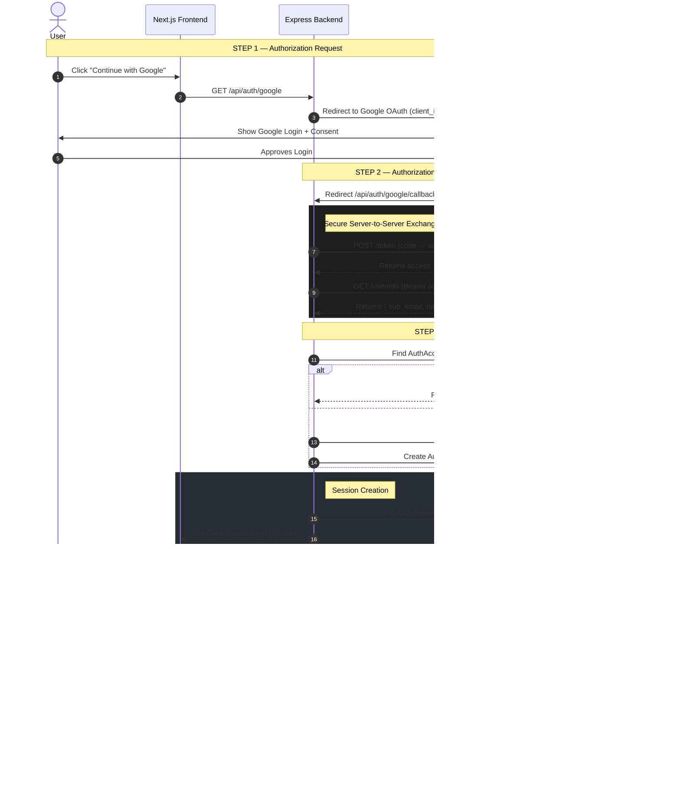
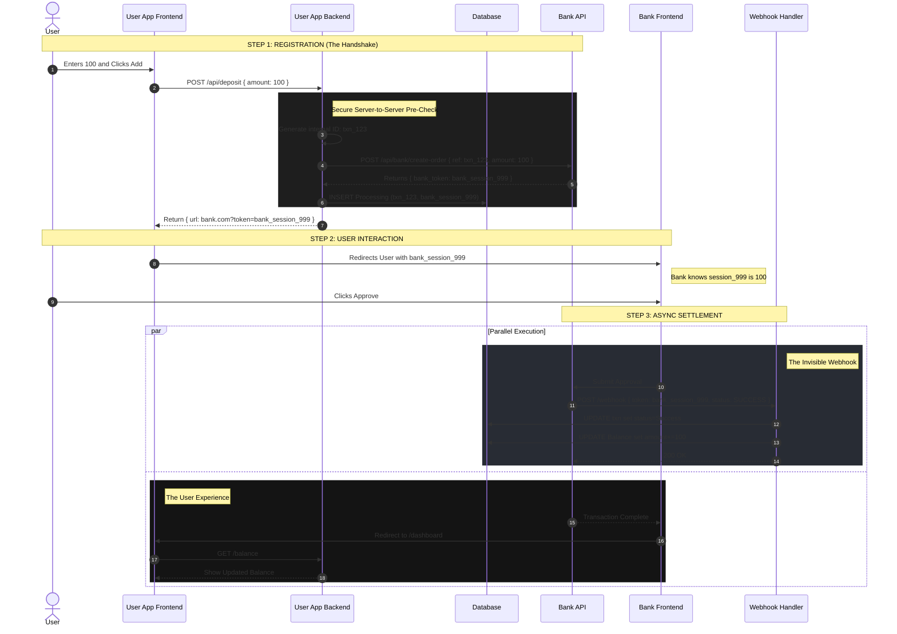
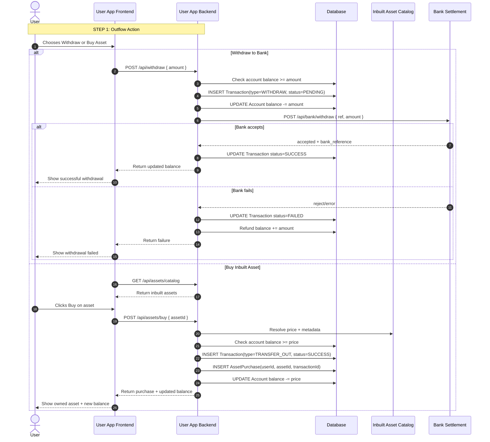

## Auth Architecture

```mermaid
    sequenceDiagram
    autonumber
    actor User
    participant FE as Next.js Frontend
    participant BE as Express Backend
    participant Google as Google OAuth Server
    participant DB as PostgreSQL (Prisma)

    Note over User,Google: STEP 1 — Authorization Request

    User->>FE: Click "Continue with Google"
    FE->>BE: GET /api/auth/google
    BE->>Google: Redirect to Google OAuth (client_id, redirect_uri, scope)
    Google->>User: Show Google Login + Consent
    User->>Google: Approves Login

    Note over Google,BE: STEP 2 — Authorization Code Grant

    Google->>BE: Redirect /api/auth/google/callback?code=AUTH_CODE

    rect rgb(30, 30, 30)
        Note right of BE: Secure Server-to-Server Exchange
        BE->>Google: POST /token (code → access_token)
        Google-->>BE: Returns access_token
        BE->>Google: GET /userinfo (Bearer access_token)
        Google-->>BE: Returns { sub, email, name, picture }
    end

    Note over BE,DB: STEP 3 — Identity Resolution

    BE->>DB: Find AuthAccount(provider=GOOGLE, sub)
    
    alt Existing Account
        DB-->>BE: Return existing User
    else New User
        BE->>DB: Create User
        BE->>DB: Create AuthAccount(GOOGLE, sub)
    end

    rect rgb(40, 44, 52)
        Note right of BE: Session Creation
        BE->>DB: INSERT Session (session_id, userId, expiresAt)
        BE-->>FE: Set-Cookie session_id (HttpOnly)
    end

    BE-->>FE: Redirect to Frontend (/)

    Note over FE,BE: STEP 4 — Authenticated State

    FE->>BE: GET /api/user/me (with cookie)
    BE->>DB: Find Session(session_id)
    
    alt Valid Session
        DB-->>BE: Session + User
        BE-->>FE: Return User JSON
    else Expired / Invalid
        BE-->>FE: 401 Unauthorized
    end
```

## Transaction Architecture

```mermaid
sequenceDiagram
    autonumber
    actor User
    participant UA_FE as User App Frontend
    participant UA_BE as User App Backend
    participant DB as Database
    participant Bank_API as Bank API
    participant Bank_FE as Bank Frontend
    participant Webhook as Webhook Handler

    Note over User, Bank_API: STEP 1: REGISTRATION (The Handshake)
    User->>UA_FE: Enters 100 and Clicks Add
    UA_FE->>UA_BE: POST /api/deposit { amount: 100 }
    
    rect rgb(30, 30, 30)
        Note right of UA_BE: Secure Server-to-Server Pre-Check
        UA_BE->>UA_BE: Generate internal ID: txn_123
        UA_BE->>Bank_API: POST /api/bank/create-order { ref: txn_123, amount: 100 }
        Bank_API-->>UA_BE: Returns { bank_token: bank_session_999 }
        UA_BE->>DB: INSERT Processing (txn_123, bank_session_999)
    end
    
    UA_BE-->>UA_FE: Return { url: bank.com?token=bank_session_999 }

    Note over User, Bank_FE: STEP 2: USER INTERACTION
    UA_FE->>Bank_FE: Redirects User with bank_session_999
    Note right of Bank_FE: Bank knows session_999 is 100
    User->>Bank_FE: Clicks Approve
    
    Note over Bank_API, Webhook: STEP 3: ASYNC SETTLEMENT
    
    par Parallel Execution
        rect rgb(40, 44, 52)
            Note right of Webhook: The Invisible Webhook
            Bank_FE->>Bank_API: Submit Approval
            Bank_API->>Webhook: POST /webhook { token: bank_session_999, status: SUCCESS }
            Webhook->>DB: UPDATE txn set status=Success
            Webhook->>DB: UPDATE Balance set amount+=100
            Webhook-->>Bank_API: 200 OK
        end
        and
        rect rgb(20, 20, 20)
            Note right of UA_FE: The User Experience
            Bank_API-->>Bank_FE: Transaction Complete
            Bank_FE->>UA_FE: Redirect to /dashboard
            UA_FE->>UA_BE: GET /balance
            UA_BE-->>UA_FE: Show Updated Balance
        end
    end
```

## Spend / Withdraw Architecture

```mermaid
sequenceDiagram
    autonumber
    actor User
    participant FE as User App Frontend
    participant BE as User App Backend
    participant DB as Database
    participant Assets as Inbuilt Asset Catalog
    participant Bank as Bank Settlement

    Note over User,BE: STEP 1: Outflow Action
    User->>FE: Chooses Withdraw or Buy Asset

    alt Withdraw to Bank
        FE->>BE: POST /api/withdraw { amount }
        BE->>DB: Check account balance >= amount
        BE->>DB: INSERT Transaction(type=WITHDRAW, status=PENDING)
        BE->>DB: UPDATE Account balance -= amount
        BE->>Bank: POST /api/bank/withdraw { ref, amount }
        alt Bank accepts
            Bank-->>BE: accepted + bank_reference
            BE->>DB: UPDATE Transaction status=SUCCESS
            BE-->>FE: Return updated balance
            FE-->>User: Show successful withdrawal
        else Bank fails
            Bank-->>BE: reject/error
            BE->>DB: UPDATE Transaction status=FAILED
            BE->>DB: Refund balance += amount
            BE-->>FE: Return failure
            FE-->>User: Show withdrawal failed
        end
    else Buy Inbuilt Asset
        FE->>BE: GET /api/assets/catalog
        BE-->>FE: Return inbuilt assets
        User->>FE: Clicks Buy on asset
        FE->>BE: POST /api/assets/buy { assetId }
        BE->>Assets: Resolve price + metadata
        BE->>DB: Check account balance >= price
        BE->>DB: INSERT Transaction(type=TRANSFER_OUT, status=SUCCESS)
        BE->>DB: INSERT AssetPurchase(userId, assetId, transactionId)
        BE->>DB: UPDATE Account balance -= price
        BE-->>FE: Return purchase + updated balance
        FE-->>User: Show owned asset + new balance
    end
```
